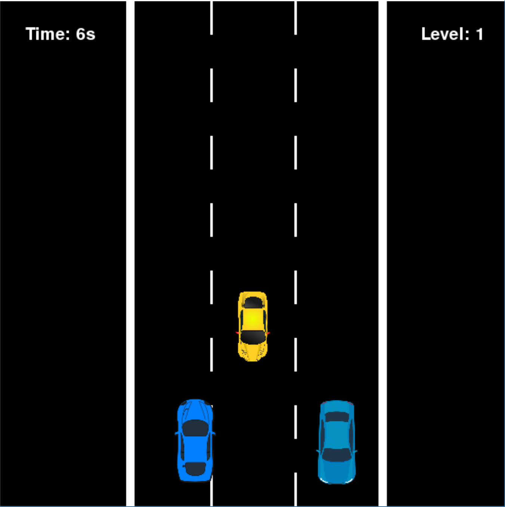
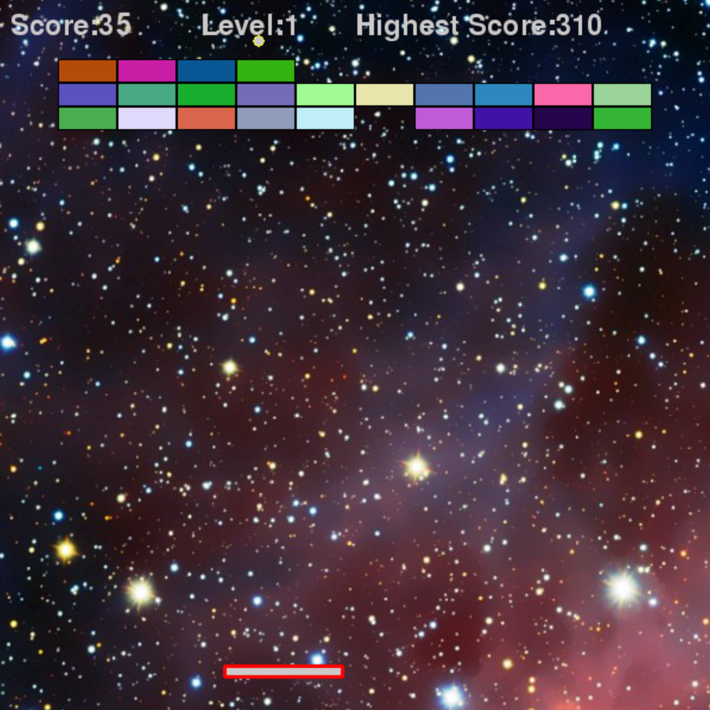
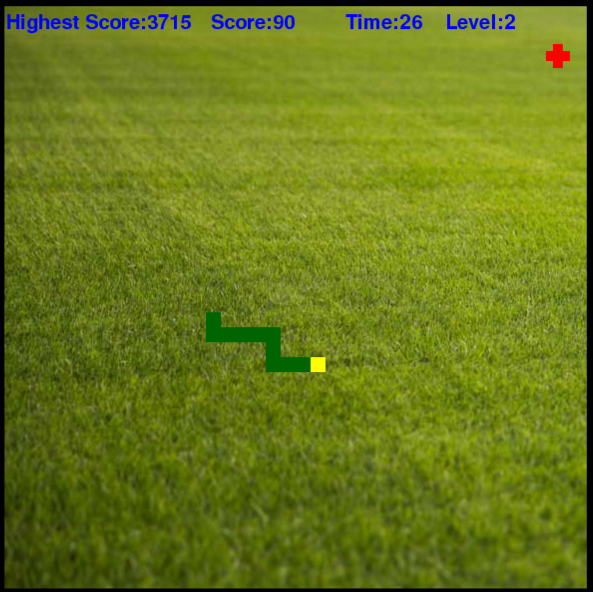

Classic Atari games built by pygame in python
---------------------------------------------


Requirements
------------
```
bash
python3
pygame
```

Prepare the environment
-----------------------
`pip install pygame`

How to start
------------
1. Clone this project: `git clone https://github.com/xiacijie/Classic-Games.git`
2. Enter the project: `cd Classic-Games`
3. Enter the respective folder: `cd XXX`
4. Start the game: `python3 XXX.py`

Screenshots
-----------
-Race Car




-Bricks



-Snake



Game Help
---------
By pressing <kbd>up</kbd>, <kbd>down</kbd>, <kbd>left</kbd>, <kbd>right</kbd> to control the characters moving around.

Join the project
----------------
Feel free to join this project.
